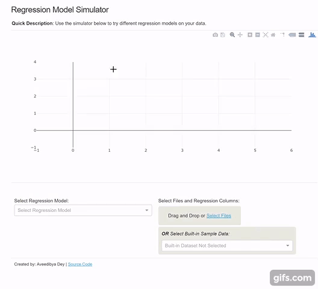

# [Regression Simulator](https://regressionsimulator.herokuapp.com/)

__Description:__ Provides an easy way to simulate different regression models on your data. Data file can be uploaded in CSV or XLS format. ALternatively, use the built-in sample datasets to try out different regression models.

Models supported include:
 * Simple Linear Regression
 * Support Vector Regression with various kernel functions: Radial Basis, Linear, Ploynomial and Sigmoid
 * Robust Linear Regression (RANSAC Model)
 * Theilsen Linear Regression

All these models have been built using sklearn library in Python. User interface is built using Dash and Plotly.

